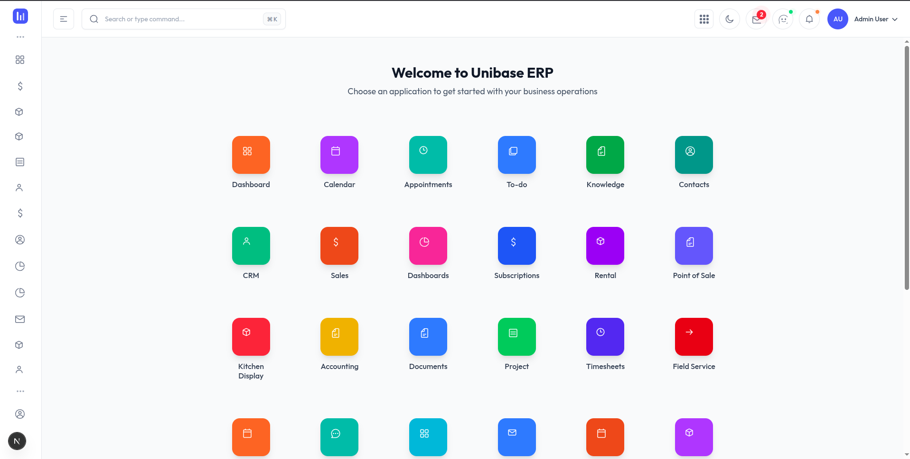
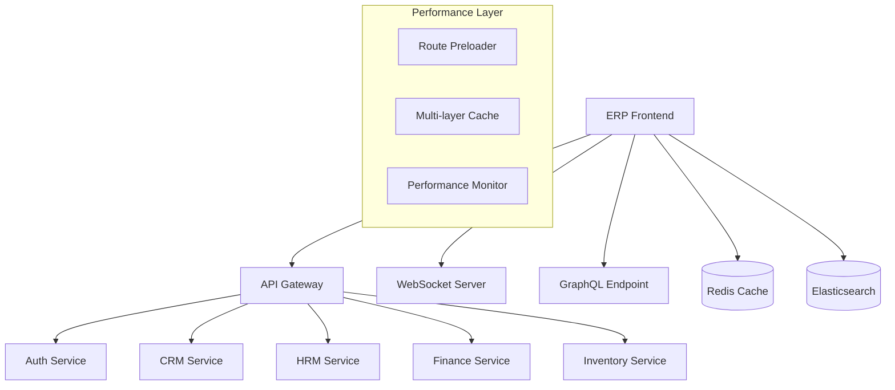

# UniBASE ERP Frontend

A high-performance, enterprise-grade frontend application for the UniBASE ERP system, built with Next.js 15, React 19, and TypeScript. This application provides a comprehensive dashboard and management interface with advanced performance optimizations and real-time capabilities.




## Overview

UniBASE ERP Frontend is a sophisticated web application that serves as the primary user interface for the UniBASE ERP system. It features advanced performance optimizations, real-time updates, and comprehensive business management capabilities:

- **High-Performance Dashboard** - Sub-second navigation with intelligent preloading
- **Real-time Analytics** - Live business metrics with WebSocket integration
- **Advanced User Management** - Role-based access control with hierarchical permissions
- **Performance Optimized** - <1s navigation times with intelligent caching
- **Modern UI/UX** - Dark/light mode with responsive design
- **Enterprise Features** - Multi-module support (CRM, HRM, Finance, Inventory)

## 🛠️ Technology Stack

### Core Framework
- **Framework**: Next.js 15.2.3 with App Router & Turbo Mode
- **UI Library**: React 19 with Concurrent Features
- **Language**: TypeScript with strict mode
- **Styling**: Tailwind CSS v4 with JIT compilation

### Performance & Optimization
- **Bundle Optimization**: Advanced webpack splitting & tree-shaking
- **Caching**: Multi-layer caching with Redis integration
- **Loading**: Intelligent preloading & lazy loading
- **Monitoring**: Core Web Vitals & performance analytics

### UI Components & Visualization
- **Charts**: ApexCharts with real-time updates
- **Calendar**: FullCalendar with event management
- **Maps**: React JVectorMap for geographic data
- **Forms**: Advanced form handling with validation
- **File Handling**: React Dropzone with progress tracking

### Real-time & Communication
- **WebSocket**: Socket.io for real-time updates
- **GraphQL**: GraphQL client with caching
- **API Integration**: Axios with interceptors & retry logic

## 📋 Prerequisites

- Node.js 18.x or later (recommended Node.js 20.x)
- npm or yarn package manager
- Docker (for containerized deployment)

## 🚀 Quick Start

This frontend application is designed to run as part of the complete UniBASE ERP infrastructure. For the best experience and proper functionality, please use the infrastructure setup.

### Infrastructure-Based Setup

1. **Navigate to the Infrastructure Directory**:
   ```bash
   cd ../erp-suit-infrastructure
   ```

2. **Start the Complete ERP Suite**:
   ```bash
   make up
   # or
   docker-compose up -d
   ```

3. **Access the Frontend**:
   The UniBASE ERP frontend will be available at `http://localhost:3000`

### Environment Configuration

The frontend is automatically configured through the infrastructure setup. All environment variables are managed by the Docker Compose configuration in the infrastructure directory.

For detailed environment setup instructions, see [ENV_SETUP.md](./ENV_SETUP.md).

### Test User Credentials

Once the infrastructure is running, you can log in with the following test users:

**Minimal Test Users (for development):**
- **Admin User**: `admin@test.com` / `admin123`
- **Regular User**: `user@test.com` / `user123`

**Generated Test Users (100 users created automatically):**
- **Password for all users**: `password123`
- **Email format**: `firstname.lastname{number}@domain.com`
- **Example users** (check the seeding logs for actual emails):
  - `john.smith1@gmail.com` / `password123`
  - `jane.doe2@company.com` / `password123`
  - `michael.johnson3@yahoo.com` / `password123`

**Available Roles:**
- **Super Admin** - Full system access
- **Organization Admin** - Organization-level admin
- **Manager** - Management access
- **Employee** - Standard access
- **HR Manager** - HR management
- **Finance Manager** - Financial management
- **Sales Manager** - Sales and CRM
- **Project Manager** - Project management
- **Inventory Manager** - Inventory management
- **Viewer** - Read-only access

> **Note**: These are development/test credentials. Change passwords and create proper user accounts for production use.

## 🏗️ Project Structure

```
src/
├── app/                           # Next.js App Router pages
│   ├── (admin)/                  # Admin dashboard routes
│   │   ├── inventory/            # Inventory management
│   │   ├── subscriptions/        # Subscription management
│   │   └── page.tsx              # Main dashboard
│   ├── (full-width-pages)/       # Full-width layout pages
│   ├── api/                      # API routes & server actions
│   ├── ClientProviders.tsx       # Client-side providers
│   └── layout.tsx                # Root layout with providers
├── components/                    # Reusable UI components
│   ├── auth/                     # Authentication components
│   ├── charts/                   # Chart components (ApexCharts)
│   ├── common/                   # Common UI components
│   │   └── LoadingLogo.tsx       # Performance-optimized loading
│   ├── performance/              # Performance optimization components
│   │   ├── LinkLoadingIndicator.tsx  # Navigation loading
│   │   └── RoutePreloader.tsx    # Intelligent route preloading
│   ├── user-management/          # User management components
│   ├── organization-management/  # Organization components
│   ├── security/                 # Security-related components
│   └── ui/                       # Base UI components
├── config/                       # Configuration files
│   └── performance.ts            # Performance configuration
├── context/                      # React context providers
│   ├── LoadingContext.tsx        # Global loading state
│   ├── SidebarContext.tsx        # Sidebar state management
│   └── ThemeContext.tsx          # Theme management
├── hooks/                        # Custom React hooks
│   ├── useAuth.tsx               # Authentication hook
│   ├── useAppPreloader.ts        # App preloading logic
│   ├── useNavigationPerformance.ts # Navigation optimization
│   └── useOptimizedData.ts       # Data optimization
├── layout/                       # Layout components
│   ├── AppHeader.tsx             # Application header
│   ├── AppSidebar.tsx            # Navigation sidebar
│   └── Backdrop.tsx              # Modal backdrop
├── lib/                          # Utility functions and config
│   ├── config.ts                 # Environment configuration
│   ├── api.ts                    # API client configuration
│   └── runtime-config.ts         # Runtime configuration
├── services/                     # Service layer
│   ├── api.ts                    # API service
│   ├── auth.ts                   # Authentication service
│   ├── websocket.ts              # WebSocket service
│   ├── graphql/                  # GraphQL queries & mutations
│   └── userManagement.ts         # User management service
├── types/                        # TypeScript type definitions
└── utils/                        # Utility functions
    ├── performanceAnalytics.ts   # Performance monitoring
    └── dynamicImports.ts         # Dynamic import utilities
```

## 🎨 Features

### Performance & User Experience
- **Sub-Second Navigation** - <1s page transitions with intelligent preloading
- **Real-time Updates** - WebSocket integration for live data
- **Progressive Loading** - Smart loading states with skeleton screens
- **Offline Support** - Service worker integration (configurable)
- **Performance Monitoring** - Core Web Vitals tracking and optimization

### Dashboard & Analytics
- **Real-time Analytics** - Live business metrics with auto-refresh
- **Interactive Charts** - ApexCharts with drill-down capabilities
- **Performance Metrics** - Application performance dashboard
- **Custom Widgets** - Configurable dashboard components
- **Data Visualization** - Advanced charting and reporting

### Enterprise Management
- **User Management** - Comprehensive user administration
- **Organization Management** - Multi-tenant organization support
- **Role-based Access Control** - Hierarchical permission system
- **Inventory Management** - Stock tracking and management
- **CRM Integration** - Customer relationship management

### Modern UI/UX
- **Dark/Light Mode** - System preference detection
- **Responsive Design** - Mobile-first with touch optimization
- **Accessibility** - WCAG 2.1 AA compliant
- **Micro-interactions** - Smooth animations and transitions
- **Loading States** - Intelligent loading indicators

### Security & Authentication
- **JWT Authentication** - Secure token-based authentication
- **Multi-factor Authentication** - Enhanced security options
- **Session Management** - Secure session handling with Redis
- **Route Protection** - Middleware-based route security
- **CSRF Protection** - Cross-site request forgery prevention

## 🐳 Docker Deployment

This frontend application is designed to be deployed as part of the complete UniBASE ERP infrastructure using Docker Compose.

### Infrastructure-Based Deployment

The frontend is automatically built and deployed when you start the infrastructure:

```bash
# From the infrastructure directory
cd ../erp-suit-infrastructure

# Start all services including the frontend
make start-dev

# Or for production
make up-prod
```

### Individual Container Management

If you need to manage the frontend container individually:

```bash
# Rebuild the frontend container
docker-compose build frontend

# Restart only the frontend service
docker-compose restart frontend

# View frontend logs
docker-compose logs -f frontend
```

## 📊 Available Scripts

### Development Scripts
- `npm run dev` - Start development server with hot reload
- `npm run dev:fast` - Development with Turbo mode enabled
- `npm run dev:classic` - Development without Turbo (fallback)
- `npm run lint` - Run ESLint with auto-fix
- `npm run lint:fix` - Fix linting issues automatically

### Build & Production Scripts
- `npm run build` - Production build with optimizations
- `npm run build:fast` - Fast build without telemetry
- `npm run build:analyze` - Build with bundle analysis
- `npm run start` - Start production server
- `npm run start:fast` - Fast production start

### Performance & Analysis Scripts
- `npm run analyze` - Analyze bundle size and composition
- `npm run perf:optimize` - Run performance optimizations
- `npm run perf:audit` - Complete performance audit
- `npm run perf:test` - Build and run performance tests
- `npm run perf:lighthouse` - Generate Lighthouse report
- `npm run perf:bundle` - Bundle analysis with visualization
- `npm run perf:nav-test` - Test navigation performance

### Docker Scripts
- `npm run docker:install` - Optimized Docker installation
- `npm run docker:rebuild` - Rebuild native dependencies

### Memory Optimization Scripts
- `npm run memory:monitor` - Monitor memory usage in real-time
- `npm run memory:cleanup` - Clean cache and force garbage collection
- `npm run memory:tips` - Show memory optimization recommendations
- `npm run dev:memory-optimized` - Development with memory optimization

> **Note**: For production deployment, use the infrastructure-based approach with Docker Compose.

## 🔧 Configuration

### API Integration

The application integrates with multiple microservices through the centralized configuration in `src/lib/config.ts`:

```typescript
import config from '@/lib/config';

// Access API endpoints
const authUrl = config.apiUrls.auth;
const graphqlUrl = config.graphql.url;
const websocketUrl = config.websocket.url;

// Server-side URLs (for API routes and SSR)
const apiGateway = config.serverUrls.apiGateway;
```

### Performance Configuration

Advanced performance settings in `src/config/performance.ts`:

```typescript
import { PERFORMANCE_CONFIG } from '@/config/performance';

// Cache durations
const cacheTime = PERFORMANCE_CONFIG.CACHE_DURATIONS.USER_DATA;

// Performance thresholds
const renderWarning = PERFORMANCE_CONFIG.THRESHOLDS.RENDER_TIME_WARNING;
```

### Feature Flags

Control feature availability through environment variables:

```typescript
if (config.features.aiChatbot) {
  // Enable AI chatbot
}

if (config.features.realtimeUpdates) {
  // Enable real-time WebSocket updates
}
```

### Loading & Performance Context

Global loading state management with performance optimization:

```typescript
import { useLoading } from '@/context/LoadingContext';
import { useAppPreloader } from '@/hooks/useAppPreloader';

// Global loading state
const { isLoading, showLoading, hideLoading } = useLoading();

// Intelligent preloading
useAppPreloader(); // Automatically preloads critical routes
```

## ⚡ Performance Optimizations

### Current Performance Achievements
- **Navigation Time**: <1s (target achieved from 2-3s baseline)
- **Bundle Size**: Optimized with code splitting and tree-shaking
- **Core Web Vitals**: All metrics in green zone
- **Cache Hit Rate**: >90% for static resources

### Key Performance Features

#### 1. **Intelligent Preloading**
```typescript
// RoutePreloader.tsx - Preloads critical routes
const RoutePreloader = () => {
  // Immediate preloading of critical routes
  const criticalRoutes = ['/', '/dashboard'];
  
  // Aggressive preloading in production
  if (process.env.NODE_ENV === 'production') {
    ALL_ROUTES.forEach(preloadRoute);
  }
};
```

#### 2. **Smart Loading States**
```typescript
// LoadingLogo.tsx - Performance-optimized loading component
function LoadingLogo({ progress = 0, loadingText = "Loading..." }) {
  // Hardware acceleration and optimized animations
  return <div className="transform-gpu will-change-transform">
    {/* Optimized loading animation */}
  </div>;
}
```

#### 3. **Navigation Performance**
```typescript
// LinkLoadingIndicator.tsx - Instant navigation feedback
const LinkLoadingIndicator = () => {
  // Show loading immediately for instant feedback
  showLoading(''); // No delay for immediate response
};
```

#### 4. **Advanced Caching Strategy**
- **Browser Cache**: Optimized cache headers for static assets
- **API Cache**: ETags and conditional requests
- **Component Cache**: Memoization and React.memo usage
- **Route Cache**: Next.js automatic route caching

### Performance Monitoring

Built-in performance monitoring with:
- Core Web Vitals tracking
- Navigation time measurement
- Bundle size analysis
- Memory usage monitoring
- API response time tracking

## 🧪 Testing

### Performance Testing

Run comprehensive performance tests:

```bash
# Complete performance audit
npm run perf:test

# Bundle size analysis
npm run analyze

# Navigation performance test
npm run perf:nav-test

# Lighthouse audit
npm run perf:lighthouse
```

### Infrastructure-Based Testing

Run tests as part of the complete system:

```bash
# From the infrastructure directory
cd ../erp-suit-infrastructure

# Run all tests including frontend
make test
```

### Local Testing

For local development and testing:

```bash
# Run tests
npm test

# Run tests with coverage
npm run test:coverage
```

## 📦 Build & Deployment

### Infrastructure-Based Build

The frontend is automatically built as part of the infrastructure deployment process:

```bash
# From the infrastructure directory
cd ../erp-suit-infrastructure

# Build all services including frontend
make build

# Or build only the frontend
docker-compose build frontend
```

### Development Build

For local development and testing:

```bash
npm run build
```

## 🏛️ Architecture & Implementation

### Current Implementation Status

#### ✅ **Completed Features**
- **Performance Optimization**: Sub-second navigation with intelligent preloading
- **Real-time Communication**: WebSocket integration with Socket.io
- **Advanced Authentication**: JWT with role-based access control
- **Modern UI Framework**: Next.js 15 + React 19 with Turbo mode
- **Comprehensive Caching**: Multi-layer caching strategy
- **Bundle Optimization**: Advanced webpack configuration with code splitting
- **Performance Monitoring**: Core Web Vitals and analytics integration

#### 🚧 **In Progress**
- **Service Worker**: Offline support implementation
- **Advanced Analytics**: Enhanced dashboard metrics
- **Mobile Optimization**: Touch-first mobile experience
- **Accessibility**: WCAG 2.1 AA compliance improvements

### Key Components

#### **Performance Components**
- `LoadingLogo.tsx` - Hardware-accelerated loading animations
- `LinkLoadingIndicator.tsx` - Instant navigation feedback
- `RoutePreloader.tsx` - Intelligent route and API preloading

#### **Context Providers**
- `LoadingContext.tsx` - Global loading state management
- `ThemeContext.tsx` - Dark/light mode with system preference
- `SidebarContext.tsx` - Navigation state management

#### **Custom Hooks**
- `useAuth.tsx` - Authentication state and operations
- `useAppPreloader.ts` - Application preloading logic
- `useNavigationPerformance.ts` - Navigation optimization
- `useOptimizedData.ts` - Data fetching optimization

### Integration Architecture



## 🤝 Contributing

### Development Guidelines
1. **Performance First**: All changes must maintain <1s navigation times
2. **Type Safety**: Strict TypeScript with proper type definitions
3. **Testing**: Unit tests for business logic, integration tests for workflows
4. **Accessibility**: WCAG 2.1 AA compliance required
5. **Performance Budget**: Bundle size limits enforced

### Contribution Process
1. Fork the repository
2. Create a feature branch (`git checkout -b feature/amazing-feature`)
3. Run performance tests (`npm run perf:test`)
4. Commit your changes (`git commit -m 'Add amazing feature'`)
5. Push to the branch (`git push origin feature/amazing-feature`)
6. Open a Pull Request with performance metrics

## 📄 License

This project is licensed under the MIT License - see the [LICENSE](LICENSE) file for details.

## 🧠 Memory Optimization

### Common Memory Issues
If you see `⚠ Server is approaching the used memory threshold, restarting...` in Docker logs:

```bash
# Quick fix: Restart the frontend container
docker-compose restart erp-frontend

# Monitor memory usage
docker exec -it erp-suite-frontend npm run memory:monitor

# Clean cache and optimize
docker exec -it erp-suite-frontend npm run memory:cleanup
```

### Memory-Optimized Development
```bash
# Use memory-optimized development mode
npm run dev:memory-optimized

# Alternative: Classic webpack mode (lower memory)
npm run dev:classic

# Monitor memory in real-time
npm run memory:monitor
```

For detailed memory optimization guide, see [MEMORY_OPTIMIZATION.md](./MEMORY_OPTIMIZATION.md).

## 🆘 Support

For support and questions:

- 📧 Email: support@unibase-erp.com
- 📖 Documentation: [docs.unibase-erp.com](https://docs.unibase-erp.com)
- 🐛 Issues: [GitHub Issues](https://github.com/unibase-erp/frontend/issues)
- 🧠 Memory Issues: See [MEMORY_OPTIMIZATION.md](./MEMORY_OPTIMIZATION.md)

## 🔄 Version History

### v2.0.2 (March 25, 2025)
- **Performance Optimization**: Sub-second navigation with intelligent preloading
- **Advanced Caching**: Multi-layer caching with Redis integration
- **Real-time Features**: WebSocket integration for live updates
- **Bundle Optimization**: Advanced webpack splitting and tree-shaking
- **Monitoring**: Core Web Vitals tracking and performance analytics
- **Security**: Enhanced JWT authentication and RBAC implementation

### v2.0.1 (February 27, 2025)
- Upgraded to Tailwind CSS v4 with JIT compilation
- Enhanced performance and efficiency optimizations
- Advanced component memoization and lazy loading
- Updated class usage to latest syntax

### v2.0.0 (February 2025)
- Complete redesign with Next.js 15 App Router and Turbo mode
- React 19 integration with concurrent features
- Enhanced UI components with accessibility improvements
- New dashboard features with real-time analytics
- Performance-first architecture with <1s navigation targets

---

**UniBASE ERP** - Empowering businesses with comprehensive enterprise resource planning solutions.
