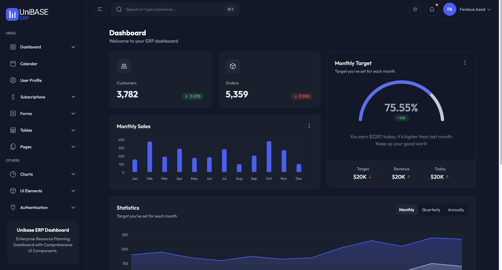

# UniBASE ERP Frontend

A modern, enterprise-grade frontend application for the UniBASE ERP system, built with Next.js 15, React 19, and TypeScript. This application provides a comprehensive dashboard and management interface for enterprise resource planning.



## Overview

UniBASE ERP Frontend is a sophisticated web application that serves as the primary user interface for the UniBASE ERP system. It provides a modern, responsive dashboard with comprehensive features for managing various business operations including:

- **Dashboard Analytics** - Real-time business metrics and KPIs
- **Subscription Management** - Billing, usage tracking, and plan management
- **User Authentication** - Secure login and role-based access control
- **Dark/Light Mode** - Flexible theming options
- **Responsive Design** - Optimized for desktop, tablet, and mobile devices

## 🛠️ Technology Stack

- **Framework**: Next.js 15.2.3 with App Router
- **UI Library**: React 19
- **Language**: TypeScript
- **Styling**: Tailwind CSS v4
- **Charts**: ApexCharts
- **Calendar**: FullCalendar
- **Maps**: React JVectorMap
- **Date Picker**: Flatpickr
- **Drag & Drop**: React DnD
- **File Upload**: React Dropzone
- **Carousel**: Swiper

## 📋 Prerequisites

- Node.js 18.x or later (recommended Node.js 20.x)
- npm or yarn package manager
- Docker (for containerized deployment)

## 🚀 Quick Start

This frontend application is designed to run as part of the complete UniBASE ERP infrastructure. For the best experience and proper functionality, please use the infrastructure setup.

### Infrastructure-Based Setup

1. **Navigate to the Infrastructure Directory**:
   ```bash
   cd ../erp-suit-infrastructure
   ```

2. **Start the Complete ERP Suite**:
   ```bash
   make up
   # or
   docker-compose up -d
   ```

3. **Access the Frontend**:
   The UniBASE ERP frontend will be available at `http://localhost:3000`

### Environment Configuration

The frontend is automatically configured through the infrastructure setup. All environment variables are managed by the Docker Compose configuration in the infrastructure directory.

For detailed environment setup instructions, see [ENV_SETUP.md](./ENV_SETUP.md).

## 🏗️ Project Structure

```
src/
├── app/                    # Next.js App Router pages
│   ├── (admin)/           # Admin dashboard routes
│   │   ├── subscriptions/ # Subscription management
│   │   └── page.tsx       # Main dashboard
│   ├── (full-width-pages)/ # Full-width layout pages
│   ├── api/               # API routes
│   └── layout.tsx         # Root layout
├── components/            # Reusable UI components
│   ├── auth/             # Authentication components
│   ├── charts/           # Chart components
│   ├── ecommerce/        # Dashboard components
│   ├── form/             # Form components
│   ├── tables/           # Table components
│   └── ui/               # Base UI components
├── context/              # React context providers
├── hooks/                # Custom React hooks
├── icons/                # SVG icons
├── layout/               # Layout components
└── lib/                  # Utility functions and config
```

## 🎨 Features

### Dashboard
- **Real-time Analytics** - Live business metrics and KPIs
- **Interactive Charts** - ApexCharts integration for data visualization
- **Monthly Targets** - Goal tracking and progress monitoring
- **Recent Orders** - Latest transaction overview
- **Demographics** - Customer and market insights

### Subscription Management
- **Billing Dashboard** - Payment history and invoice management
- **Usage Tracking** - Resource consumption monitoring
- **Plan Management** - Subscription plan selection and upgrades

### User Experience
- **Dark/Light Mode** - Toggle between themes
- **Responsive Design** - Mobile-first approach
- **Accessibility** - WCAG compliant components
- **Internationalization** - Multi-language support ready

### Authentication & Security
- **JWT Authentication** - Secure token-based auth
- **Role-based Access** - RBAC implementation
- **Session Management** - Secure session handling
- **Middleware Protection** - Route-level security

## 🐳 Docker Deployment

This frontend application is designed to be deployed as part of the complete UniBASE ERP infrastructure using Docker Compose.

### Infrastructure-Based Deployment

The frontend is automatically built and deployed when you start the infrastructure:

```bash
# From the infrastructure directory
cd ../erp-suit-infrastructure

# Start all services including the frontend
make start-dev

# Or for production
make up-prod
```

### Individual Container Management

If you need to manage the frontend container individually:

```bash
# Rebuild the frontend container
docker-compose build frontend

# Restart only the frontend service
docker-compose restart frontend

# View frontend logs
docker-compose logs -f frontend
```

## 📊 Available Scripts

These scripts are primarily used during development and CI/CD processes:

- `npm run dev` - Start development server (for local development only)
- `npm run build` - Build for production
- `npm run start` - Start production server
- `npm run lint` - Run ESLint

> **Note**: For production deployment, use the infrastructure-based approach with Docker Compose.

## 🔧 Configuration

### API Integration

The application integrates with multiple microservices through the centralized configuration in `src/lib/config.ts`:

```typescript
import config from '@/lib/config';

// Access API endpoints
const authUrl = config.apiUrls.auth;
const graphqlUrl = config.graphql.url;
```

### Feature Flags

Control feature availability through environment variables:

```typescript
if (config.features.aiChatbot) {
  // Enable AI chatbot
}

if (config.features.realtimeUpdates) {
  // Enable real-time updates
}
```

## 🧪 Testing

### Infrastructure-Based Testing

Run tests as part of the complete system:

```bash
# From the infrastructure directory
cd ../erp-suit-infrastructure

# Run all tests including frontend
make test
```

### Local Testing

For local development and testing:

```bash
# Run tests
npm test

# Run tests with coverage
npm run test:coverage
```

## 📦 Build & Deployment

### Infrastructure-Based Build

The frontend is automatically built as part of the infrastructure deployment process:

```bash
# From the infrastructure directory
cd ../erp-suit-infrastructure

# Build all services including frontend
make build

# Or build only the frontend
docker-compose build frontend
```

### Development Build

For local development and testing:

```bash
npm run build
```

## 🤝 Contributing

1. Fork the repository
2. Create a feature branch (`git checkout -b feature/amazing-feature`)
3. Commit your changes (`git commit -m 'Add amazing feature'`)
4. Push to the branch (`git push origin feature/amazing-feature`)
5. Open a Pull Request

## 📄 License

This project is licensed under the MIT License - see the [LICENSE](LICENSE) file for details.

## 🆘 Support

For support and questions:

- 📧 Email: support@unibase-erp.com
- 📖 Documentation: [docs.unibase-erp.com](https://docs.unibase-erp.com)
- 🐛 Issues: [GitHub Issues](https://github.com/unibase-erp/frontend/issues)

## 🔄 Version History

### v2.0.2 (March 25, 2025)
- Upgraded to Next.js 15.2.3 for security patches
- Fixed peer dependency issues with vector maps
- Migrated to flatpickr for React 19 compatibility

### v2.0.1 (February 27, 2025)
- Upgraded to Tailwind CSS v4
- Enhanced performance and efficiency
- Updated class usage to latest syntax

### v2.0.0 (February 2025)
- Complete redesign with Next.js 15 App Router
- React 19 integration
- Enhanced UI components and accessibility
- New dashboard features and analytics

---

**UniBASE ERP** - Empowering businesses with comprehensive enterprise resource planning solutions.
